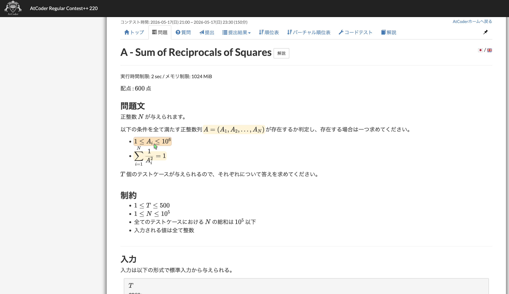

# AtCoder Statement Lens

AtCoder Statement Lens は、AtCoder の問題文に出てくる変数を追いやすくする
Chrome 拡張機能です。

問題文そのものは書き換えず、変数や数式にマウスオーバーしたときだけ、対応しそうな
記号を軽くハイライトします。

本拡張機能は非公式であり、AtCoder との提携・承認を示すものではありません。

## スクリーンショット



## 主な機能

- `https://atcoder.jp/contests/*/tasks/*` の問題ページで動作します。
- `N`, `M`, `K`, `T` などの単独変数をハイライトします。
- `A_i`, `B_i`, `S_i`, `x_i` などの添字付き変数をハイライトします。
- 変数にマウスオーバーすると、同じ変数や関連する変数をハイライトします。
- クリックでハイライトを固定し、`Escape` で解除できます。
- KaTeX の TeX annotation を読み取り、レンダリング済み数式の中の変数も検出します。
- 数式内の文字を無理に書き換えず、必要に応じて数式全体をハイライトします。
- サンプル入出力の値そのものは初期状態ではハイライト対象から外します。

## 変数の対応ルール

最初の版では、問題文を読む補助として使いやすい範囲に絞っています。

- `A_i` にマウスオーバーすると、`A_i` がハイライトされます。
- 同じ列の表記として `A`, `A_1`, `A_N` が見つかる場合、それらもハイライトされます。
- `A_i` にマウスオーバーしても、添字の `i` 単体はハイライトしません。
- `i` のような添字にマウスオーバーすると、`i` と `_i` で終わる変数がハイライトされます。
- レンダリング済み数式にマウスオーバーすると、その数式から検出された変数をまとめて
  ハイライトします。

目的は、問題文・制約・入力形式・出力形式の間で、同じ変数を探しやすくすることです。
問題文の解釈を置き換えるものではありません。

## 対応状況

現在の主対象は AtCoder の日本語問題文ですが、AtCoder の日本語/英語表示切り替えにも
対応しています。

英語版 statement では、`The` や `Score` のような英単語の先頭大文字を変数として拾わない
ようにしています。ただし、変数表記の揺れや問題ごとの書き方によっては、検出できない記号や
余分に反応する記号が残る可能性があります。

## ローカルでの使い方

1. Chrome で `chrome://extensions/` を開きます。
2. 右上の「デベロッパー モード」を有効にします。
3. 「パッケージ化されていない拡張機能を読み込む」を選びます。
4. このリポジトリの `extension/` ディレクトリを選択します。
5. AtCoder の問題ページを開きます。

## リポジトリ構成

```text
extension/
  icons/
  manifest.json
  content.js
  content.css
test/
  fixture_statement.html
docs/
  behavior.md
  dom_notes.md
  scaffold_manifest.md
```

## 開発メモ

この拡張機能は content script のみで動作します。

- 外部サービスへの通信は行いません。
- AI による説明生成は行いません。
- AtCoder 問題の解法、方針、実装案は提示しません。
- 自動提出やスコア最適化の機能はありません。
- AtCoder 公式の拡張機能ではありません。

KaTeX でレンダリングされた数式については、
`annotation[encoding="application/x-tex"]` を使って変数を検出します。
KaTeX の表示 DOM は階層が深くレイアウトに敏感なため、数式内の個別文字を直接包むことは
避けています。

`test/fixture_statement.html` は、AtCoder 外で基本的な DOM 挙動を確認するための
手動確認用 HTML です。

## 公開前メモ

- `.DS_Store` はコミットしないでください。
- `extension.pem` は Chrome が拡張機能を pack した時に生成する秘密鍵なので、
  公開しないでください。
- `extension.crx` は通常の GitHub ソース公開には不要です。
- Chrome Web Store に提出する場合は、`extension/` の中身を ZIP にしてアップロードします。
- Chrome Web Store 用の掲載文面と提出メモは `docs/chrome_web_store.md` にあります。

## 非目標

- AI Q&A
- 問題文の要約
- 解法生成
- 方針やヒューリスティックの提案
- スコア最適化
- 自動提出

## ライセンス

MIT License.

Copyright (c) 2026 滝咲白菜 (Shirona Takizaki). See `LICENSE`.
